# Dedicated Pass: Relational/Pairwise Concept Sweep + Volatility Standardization

**Status: scoped, not executed.** Created 2026-07-13 per Ross's direction: capture everything
scoped in conversation as a concrete working document rather than losing it to chat, then execute
as a dedicated pass **after every currently-running task completes** (the background
`data.py` → `analysis.py` pipeline run primarily, plus anything else in flight at the time this
pass starts — check `TaskList` before beginning). This file is the seed material for task #63;
update it in place as ideas develop, don't let it go stale relative to what's actually in
Development.md.

**Standing rules that apply to everything below** (same as the rest of this project, restated so
this doc is self-contained for whoever executes it): hypothesis stated before testing, not fished
for after; comparison-arm/research-track by default, promoted to production only deliberately;
synthetic verification before real data; one agent/fork dispatch at a time; every result — positive
or negative — gets written up in Development.md, not just the ones that work; no silent caps on
scope (if something here gets skipped or sampled rather than run exhaustively, say so explicitly).

---

## 1. Volatility standardization audit

**Not hypothetical — grep-confirmed before writing this section.** At least 7 files carry a
near-identical inline copy of the same Sharpe-ratio-denominator pattern
(`daily.std() == 0` guard, `mean/std*sqrt(252)`): `distance.py`, `fresh_holdout_compare.py`,
`portfolio_sim.py`, `sensitivity.py`, `research/capital_sim_selection_mechanism.py`,
`research/stop_loss_correlation_caps.py`, plus `backtest.py`'s own versions. This is exactly the
bug class BUG-D62 and BUG-D64 already both hit independently (`groupby(exit_date)` vs.
`resample("1D")` pooling convention) — a real, precedented risk, not a speculative one. Separately,
distinct volatility *window* conventions exist across the codebase for different purposes:

| File | Window | Purpose |
|---|---|---|
| `analysis.py` (`realized_vol` feature) | 20-bar rolling std | ML feature |
| `analysis.py` (`relative_vol_window`) | 20-bar | vol-ratio feature |
| `analysis.py` (`standardize()`) | 252-bar | cross-sectional feature normalization |
| `options.py` (`realized_vol_proxy`) | 21-day | IV proxy, annualized ×√252 |
| `research/jump_diffusion_parameter_fit.py` | 60-bar trailing | jump-detection threshold |
| `research/jump_diffusion_spread_analysis.py` | 60-bar (`JUMP_VOL_WINDOW`) | jump-detection threshold |
| 7+ files (Sharpe denominator) | full-window `daily.std()` | Sharpe ratio |

**Hypothesis**: some of this variation is legitimate (a 60-bar jump-detection threshold and a
252-bar cross-sectional feature-normalization window are genuinely different statistical tasks and
should NOT be forced to match) — but the 7-file Sharpe-denominator duplication is very likely NOT
legitimate variation, it's copy-paste that has already caused two independent bugs and is a strong
candidate for a single shared utility (e.g. `portfolio_math.sharpe_from_daily_pnl()`), the same way
BUG-D63's fix generalized `manifest_path_override` instead of leaving it per-callsite.

**Scope for the pass**: (a) audit every volatility computation in the codebase (this table is a
start, not exhaustive — the dedicated pass should re-grep and confirm the full list), (b)
classify each as "should be centralized" vs. "legitimately distinct, document why," (c) build the
shared utility for the Sharpe-denominator case specifically since it's the most consequential
(Sharpe is CAMARF's headline metric) and already has two independent bug precedents, (d) migrate
the 7+ call sites, with a regression test confirming identical output on real data before/after,
(e) explicitly check whether any of this session's puzzling comparison results (e.g. risk-parity
beating HRP, Session 22) could be partly explained by which volatility convention each sizing
method's internals actually used — this is a real, checkable question, not just a hygiene pass.

---

## 2. Tail dependence — extend beyond entries

**Current state, verified directly**: `research/tail_dependence.py` computes empirical tail
dependence (`_empirical_tail_dependence(ret_a, ret_b, q)`) between a pair's two *legs*, scoped
entirely toward "considering an asymmetric copula-based entry rule" per its own docstring. Never
asked whether tail dependence *across different pairs* matters for portfolio-level risk.

**Hypothesis**: tail dependence is a genuinely different statistical object from linear correlation
— two pairs can show low-to-moderate correlation day-to-day but still blow out together during
stress (the whole point of copula/tail-dependence theory over a Gaussian-correlation assumption).
If true, a portfolio built from pairs with low *linear* correlation (as risk-parity/HRP/k-BAHC would
all see it) could still carry hidden, correlated drawdown risk that none of those sizing methods
would detect, because none of them look at tail dependence specifically.

**Test**: extend the existing pairwise tail-dependence computation from within-pair (leg vs. leg) to
across-pair (spread vs. spread, for every pair of confirmed pairs) — build a portfolio-wide
tail-dependence matrix. Check directly against real backtest history: do pairs with high mutual tail
dependence actually show correlated drawdowns in the data, more than their linear correlation alone
would predict? If yes, this is a real, additional risk dimension — candidate for a new stop-loss/
sizing overlay (connects to task #62), and a genuinely different lens than k-BAHC's covariance
cleaning (task #58) — worth comparing what each catches that the other misses, not assuming they're
redundant.

---

## 3. The four relational-adaptation ideas (2026-07-13), restated with explicit hypotheses

### 3a. Data-quality peer-correlation cross-check (task #59)
**Hypothesis**: an unexplained single-bar price jump with no corresponding move in the symbol's
historically-correlated peers is more likely a data/pipeline artifact than a genuine symbol-specific
event; a jump *with* peer confirmation is more likely genuine (earnings, macro, sector news).
**Immediate real test set already exists**: BUG-D66's 6 non-DD flagged symbols (APP, CRWD, MLI, MTZ,
VRT, WCC) — checking their historical peers' behavior around 2023-07-26/2023-08-10 is a direct,
already-motivated validation of this hypothesis, not a synthetic-only exercise.

### 3b. Leg-level early-exit signal (task #60)
**Hypothesis (a), broadly testable now**: a pair's own leg-level price action carries exit-relevant
information beyond the aggregate spread z-score alone.
**Hypothesis (b), thinner evidence, gated on task #53**: where a genuine cross-asset lead-lag
relationship exists, the leading leg's reversal measurably precedes the lagging leg's own
spread-implied reversal, and trading on the lead signal captures P&L a spread-only exit would miss.
Keep these separable in reporting — don't let (b)'s weaker evidence base drag down (a)'s cleaner test.

### 3c. CAMARF-native relational regime indicator (task #61)
**Hypothesis**: average pairwise correlation across the confirmed-pair universe's underlying legs
rises measurably during known stress windows (2007/2008/2020, already tested in §7.12) and is at
least as informative a regime signal as `macro.py`'s external FRED-based approach, while being
entirely internally generated (no external data dependency). **Free sanity check before anything
else**: if it doesn't spike during 2007/2008/2020, the indicator itself is broken — check this first,
before comparing it to anything else.

### 3d. Stop-loss hub-leg conditioning (task #62)
**Hypothesis, most speculative of the four**: observable stress in a hub leg (e.g. DD) via one of
its pairs is predictive of adverse moves in *other* pairs sharing that leg, ahead of those pairs' own
spread-implied stop-loss trigger. Scope last, after 3a-3c show real signal — don't build in parallel
with the stronger-evidence ideas.

---

## 4. The combinatorial sweep: pair-dynamics data × everything else

Ross's framing: pair-dynamics data (correlation, cointegration strength, lead-lag structure, tail
dependence, Hurst, half-life, `coint_frac_rolling` stability, jump-diffusion parameters,
regime-conditional `hl_ratio`, `PairCharacteristicsAnalyzer` archetype, hub/leg-sharing structure) is
the common thread that could, in principle, connect to *any* other concept, research script, or
pipeline stage in the project — not just entries. The two axes:

```mermaid
graph TD
    PD["Pair-Dynamics Data<br/>correlation · EG cointegration · lead-lag<br/>tail dependence · Hurst · half-life<br/>coint_frac stability · jump params<br/>archetype · hub/leg-sharing structure"]

    subgraph Entries["Entry generation — existing, the current center of gravity"]
        EG["EG cointegration screen"]
        LLdisc["Lead-lag discovery (3 null results so far)"]
    end

    subgraph Exits["Exit timing — new, task #60"]
        LE["Leg-level early-exit signal"]
    end

    subgraph Sizing["Position sizing"]
        RP["Risk-parity / HRP / Ledoit-Wolf"]
        KB["k-BAHC covariance cleaning — task #58"]
        KY["Kelly fraction variants"]
    end

    subgraph Risk["Risk management — new"]
        SL["Stop-loss hub-leg conditioning — task #62"]
        TDoverlay["Tail-dependence sizing overlay — §2 above"]
    end

    subgraph DataQ["Data quality — new"]
        PC["Peer-correlation contamination cross-check — task #59"]
    end

    subgraph Regime["Regime detection"]
        HMM["HMM/GMM trade-timing (task #37)"]
        MAC["macro.py — external FRED regime"]
        RRI["Relational regime indicator — task #61"]
    end

    subgraph MetaStat["Multiple-testing / meta"]
        DSR["DSR/GFP trial-independence question"]
    end

    subgraph Screening["Universe / candidate screening"]
        BHBY["BH vs. BY correction"]
        TDDom["Trend-dominance / hub diagnostic"]
    end

    PD --> EG
    PD --> LLdisc
    PD --> LE
    PD --> RP
    PD --> KB
    PD --> KY
    PD --> SL
    PD --> TDoverlay
    PD --> PC
    PD --> RRI
    PD --> DSR
    PD --> BHBY
    PD --> TDDom

    LLdisc -.->|shares detection machinery| LE
    TDoverlay -.->|different risk lens than| RP
    TDoverlay -.->|comparable to| KB
    SL -.->|dynamic extension of| RP
    RRI -.->|cross-checked against| MAC
    RRI -.->|cross-checked against| HMM
    PC -.->|strengthens| DataQ
    TDDom -.->|same symbols flagged by| PC
```

**Starter set of concrete cross-combinations already identified** (not exhaustive — the dedicated
pass should work through the full matrix systematically, this is what's surfaced so far without
forcing it):

- Wavelets (task #43, discussed, never built) × cross-timeframe divergence study (task #54) — a
  natural multi-scale technical vehicle for that study rather than a standalone third Hurst
  comparison.
- `PairCharacteristicsAnalyzer` archetypes × performance clustering — do similarly-archetyped pairs
  actually co-move in *performance* (not just in the characteristics used to classify them),
  suggesting they should be risk-managed as a group?
- DSR/GFP trial accounting × pair correlation — are two backtest "trials" on correlated pairs really
  independent for multiple-testing-discount purposes, or should the effective trial count itself be
  relationally adjusted downward?
- Jump-diffusion parameters × sector clustering — do jump parameters cluster across pairs sharing
  sector exposure, informing sizing specifically during jump-prone windows?
- Trend-dominance/hub diagnostic × BUG-D66's contamination findings — DD, MLI, CRWD are flagged by
  *both* the hub-domination work and the contamination scan; genuinely related or coincidental
  overlap from both stemming from the same 2023 backfill? Not yet checked (noted in Development.md).
- Tail dependence (§2) × k-BAHC (task #58) — different risk lenses (nonlinear tail co-movement vs.
  linear covariance cleaning); worth comparing what each catches that the other misses rather than
  assuming redundancy.
- `coint_frac_rolling` stability × regime state — does a pair's rolling cointegration stability
  itself behave differently across the regimes task #61's relational indicator would define?

**Everything not listed above** — the remaining matrix cells across corporate-actions handling,
earnings blackout, WFA, capital-constrained simulation, report.py visualization, ADF/PO confirmatory
tiers, GGR distance method, Kalman filter choice, EVT/tail-risk fitting, and any other research
script or concept this project has touched — gets worked through systematically in the dedicated
pass itself, reading Development.md's full module history rather than free-associating from memory,
per the verify-before-trusting standard applied to my own recall.

**Explicitly out of scope for this pass**: the separate NQ/ES futures pairs-trading project. It
shares a conceptual echo (lead-lag propagation, the "17→71" signal system) but is a different
codebase, different thesis (explicitly not mean-reversion), and different session-log registry per
CLAUDE.md — noting the philosophical overlap here is fine, importing anything across the boundary is
not.

---

## 6. Cointegration / correlation / copula integration (2026-07-13)

Grew out of Ross asking about alternative cointegration variables, "cointegrating cointegration,"
wavelets, regimes, and copula-based correlation. Confirmed with Ross: comparison-first for all of
it, and — the key correction that governs everything below — **cointegration only applies to
non-stationary (I(1)) series with a genuine shared stochastic trend. Forcing it onto an already-
stationary derived statistic (a bounded ratio, a probability, a rank) is a category error, not a
stricter version of the test.** Correlation or copulas are the right tool for those, not a fallback.

### 6.0 Shared prerequisite: a stationarity pre-check utility, built once

Every idea below hinges on the same question — is this new variable I(1) (cointegration applies) or
stationary (correlation/copula applies) — and that question should be answered empirically (ADF/KPSS),
not assumed per-idea. Build ONE shared utility (`stationarity_check(series) -> {"is_i1": bool, ...}`)
that every comparison arm below calls before choosing its dependence tool, rather than re-litigating
this per module. This is the single piece of new shared infrastructure this section needs; everything
else composes from it plus tools that already exist (Spearman correlation is already computed
alongside Pearson in `analysis.py`'s correlation matrices — a copula-based measure is not starting
from zero).

### 6.1 Correlation via copulas — Ross's specific ask

Fit parametric copulas (Gaussian, Student-t, Clayton, Gumbel — each capturing a different real
dependence shape: Gaussian has no tail dependence, Student-t has symmetric tail dependence, Clayton
captures lower-tail-only "crash together" asymmetry, Gumbel captures upper-tail-only) to each
candidate pair's return distribution, and compare the copula-implied dependence against plain
Pearson correlation. **Hypothesis**: Pearson correlation, sensitive to outliers and blind to
nonlinear/asymmetric dependence, under-represents pairs whose real relationship is concentrated in
the tails (crash-together risk) rather than spread uniformly across the return distribution — a
fitted Clayton copula would surface these where a linear |ρ|≥0.40 pre-filter might not. Directly
extends `research/tail_dependence.py`, which already computes empirical tail dependence but has
never been used as a screening/comparison lens against Pearson.

### 6.2 Volatility cointegration — testing the boundary case, not assuming it

Volatility series are the one candidate variable where cointegration might genuinely be the right
tool rather than correlation — some literature treats log-volatility as long-memory/near-unit-root.
Run the §6.0 stationarity check on realized-vol series for several candidate pairs FIRST; only if
genuinely I(1), test EG cointegration between two related assets' volatility (does their *risk*, not
their price, share a long-run equilibrium — economically distinct from price cointegration). If
stationary (plausible outcome, report honestly either way), fall back to correlation/copula between
the vol series instead.

### 6.3 "Cointegrating cointegration" → corrected to correlating `coint_frac_rolling` — merges into task #61

`coint_frac_rolling` is a bounded [0,1] rolling statistic, almost certainly stationary — the
§6.0 check should confirm this quickly. The valid version of Ross's idea: correlate (not cointegrate)
one pair's `coint_frac_rolling` series against another's, testing whether relationship-strength
itself moves together across pairs — a real signal of a shared regime/stress driver. This is not a
new task, it's the concrete mechanism for task #61's relational regime indicator — update #61's
scope to build this explicitly rather than only the simpler universe-average version.

### 6.4 Cointegrating/correlating regimes — corrected, split in two, connects to #37/#61

Regime *state* sequences (HMM labels) are categorical — cointegration and Pearson correlation both
literally do not apply; a transition-matrix comparison or mutual information is the right tool.
Regime *probability* (a continuous HMM posterior) is bounded [0,1], almost certainly stationary —
correlation or copula-based dependence applies, not cointegration. Test whether two pairs' regime
probabilities show elevated tail dependence during stress specifically (connects directly to §6.6
below) — feeds task #37 and #61, not a standalone task.

### 6.5 Wavelet-scale cointegration — upgrades task #43/#54, not just an add-on

Wavelet decomposition splits ONE series into scale-specific components without needing separately
resampled OHLC bars. Testing cointegration (or correlation/copula, per §6.0's check applied at each
scale — different scales could plausibly have different stationarity properties) at each wavelet
scale is a real, published technique (multi-resolution cointegration analysis) that may be a
mathematically cleaner way to answer "does this pair relate at short horizons but not long ones"
than resampling into separate 1h/1D/1M bars, since it avoids aggregation-boundary and lag-absorption
artifacts. **Promote this from task #43 (standalone third Hurst comparison) to the primary technical
vehicle for task #54 (cross-timeframe divergence study)** — update #54's scope accordingly rather
than running wavelets as a side comparison.

### 6.6 Regime-conditional copula shifts — a new, well-motivated candidate

Does the copula TYPE/parameters fitted to a pair change across regimes — e.g. Gaussian-like (no
tail dependence) in calm periods, shifting toward Clayton-like (lower-tail dependence) in stress
periods? This is a well-published real phenomenon (correlation/dependence asymmetry increasing in
downturns). If confirmed on CAMARF's own data, a shift toward higher tail dependence is a candidate
early-warning signal for position de-risking — connects to task #61 (regime indicator) and task #62
(stop-loss conditioning) as a genuinely different signal source than either currently uses.

### 6.7 Portfolio-level copula risk — connects to §2 (tail dependence) and k-BAHC (#58)

A copula fit across the full confirmed-pair set gives a nonlinear picture of portfolio tail risk
that risk-parity/HRP/k-BAHC (all fundamentally covariance-based, i.e. linear) cannot see by
construction. A copula-implied portfolio VaR/CVaR compared against each of those methods' implied
risk is a natural three-way comparison: which method's risk estimate best matches what actually
happens in the tails of CAMARF's own backtest history?

### 6.8 Prioritization — which of 6.1-6.7 make the most logical sense to build first

Ranked by (a) how directly they extend something already built/verified and (b) how self-contained
they are: **6.3 (correlating coint_frac_rolling, merges into #61)** and **6.5 (wavelet-scale
cointegration, upgrades #43/#54)** first — both are corrections/upgrades to already-scoped work, not
new standalone builds. **6.1 (copula-based correlation)** second — extends `tail_dependence.py`
directly, self-contained. **6.2 (volatility cointegration)** and **6.6 (regime-conditional copula
shifts)** third — genuinely new, but each is a clean, well-defined single hypothesis test. **6.7
(portfolio copula risk)** last — depends on 6.1's per-pair copula-fitting machinery existing first.
6.4 (regime correlation) has no independent priority — it's absorbed into #37/#61's existing scope.

## 7. Analysis-on-analysis: second-order meta-analytical ideas (2026-07-13)

Ross found the "analysis on top of analysis" pattern in §6.3 (correlating `coint_frac_rolling`
across pairs instead of raw prices) intriguing and asked for more in that vein — take an existing
analytical OUTPUT and treat it as new raw data for a further analysis, rather than only ever going
back to price data. Organized by what becomes the "new raw data":

### 7.1 Meta-time-series on derived statistics
- **Half-life/Hurst as time series, not snapshots**: track rolling half-life and Hurst per pair and
  test whether THOSE series show their own structure (autocorrelation, regime shifts) — a drifting
  half-life could be an early-warning signal for degrading tradeability before `coint_frac_rolling`
  itself breaks down.
- **Jump-intensity clustering**: does a symbol's fitted jump parameter (λ, from the existing Merton
  MLE work) cluster in time — does one jump make another more likely soon after? A real, published
  phenomenon (self-exciting/Hawkes processes); the current fit assumes constant intensity, so this
  would be a genuine upgrade, not just a side comparison.

### 7.2 Graph analysis on the hub/leg-sharing structure
**Not starting from zero** — `research/graphical_lasso_clusters.py` already exists (Bien & Tibshirani
2011 sparse inverse covariance, produces partial correlations + clusters). CAMARF's confirmed pairs
already form a graph (symbols as nodes, pairs as edges); the DD/MLI/CRWD hub-domination finding was
discovered ad hoc rather than measured formally. Extend with degree/betweenness centrality (formal
hub-ness instead of eyeballing "DD appears a lot") and community detection (e.g. Louvain) on top of
the existing graphical-lasso output, to find natural pair-clusters beyond the static sector/archetype
tags.

### 7.3 Distributional analysis on p-values themselves
Instead of counting EG-test pass/fail at a fixed threshold, fit a two-component mixture (uniform
null + beta-distributed true-positive component) to the FULL p-value histogram across the candidate
universe — Storey's π0 estimation, a real published technique — to get a data-driven estimate of
what fraction of the universe is genuinely cointegrated, independent of any fixed cutoff. Feeds
directly back into the DSR/GFP trial-accounting discussion with a real number instead of a
threshold-survivor count.

### 7.4 Meta-analysis of the backtest's own trade output
- Cluster individual TRADES (not pairs) by holding period, entry z-score, regime-at-entry — the
  archetype idea one level down from pairs. Some trades within an otherwise "good" pair may behave
  very differently depending on conditions the pair-level classification can't see.
- Survival analysis (Kaplan-Meier/Cox) on trade duration instead of a flat half-life summary —
  properly handles trades stopped out before reverting (censored observations) rather than just
  averaging over them.

### 7.5 The two strongest — most novel, most in the project's own spirit
- **Pair-survival-across-runs**: track which pairs are persistently confirmed across every
  historical `analysis.py` run vs. which flicker in and out — a durability signal distinct from
  `coint_frac_rolling` (stability WITHIN one continuous test) since it measures stability ACROSS
  independent re-runs of the whole pipeline over the project's calendar history. CAMARF analyzing
  its own production history as data.
- **DSR trial-count self-check over time**: track how the reported DSR z-score evolved as trials
  accumulated across this project's actual history — does it show the classic "apparent best result
  improves mainly through search volume" signature DSR itself exists to catch? Literally applying
  the project's own core statistical discipline to its own research process, not just its results —
  an unusually honest, self-referential check, for better or worse whichever way it lands.

Not yet triaged into the §6.8-style priority order or assigned to specific tasks — captured here for
the dedicated pass to work through, per the same comparison-first, hypothesis-stated-before-testing
discipline as everything else in this document.

## 8. Execution sequencing

Do not start this pass until `TaskList` shows no other task/agent in flight — specifically the
background `data.py`→`analysis.py` pipeline run (task #17) and whatever else is running at the time.
Once clear, execute as a single dedicated agent dispatch (task #63), working through the matrix in
§4 systematically, applying §1's volatility audit, §2's tail-dependence extension, and §6's
cointegration/correlation/copula integration alongside it, in §6.8's priority order, since all of
these are related lenses on the same underlying question. Write findings to Development.md and
`docs/FINDINGS.md` as they land, per the project's standing research-goes-to-findings-by-default
policy — promotion to PAPER.md is a separate, later, deliberate decision.

## 9. Rabbit holes — deep, chain-of-thought-documented follow-ons from landed results (2026-07-13)

Per Ross's explicit overnight instruction: when research yields a result, chase every genuine
connection to its deepest point (market structure, beta, sector, cross-idea links, even entirely
new self-invented measurements), with the reasoning chain documented, not just the conclusion.
Confirmed with Ross: prioritize depth on what's already emerging from tonight's queued work, but
fully open to new directions too if something independently seems worth it. Production/PAPER.md
discipline is explicitly unchanged — comparison-first, draft-and-flag, same as the rest of this
document.

### 9.1 Beta-neutral lag structure — does the lag-search "signal" survive removing shared market beta?

**Chain of reasoning, in order:**
1. §52's validation (`lag_sweep_validation.py`) used 24 known-confirmed pairs as a positive control
   and 8 comparison pairs (2 real near-miss, 6 hand-picked "arbitrary" cross-sector pairs with no
   expected relationship) as a rough null.
2. Observed: 6/8 of the "arbitrary" pairs ALSO showed a clean lag-0 correlation peak — including
   QQQ/GS (0.646) and FHB/EME (0.271), neither pair sharing a sector (tech-heavy ETF vs. financial;
   regional bank vs. engineering/construction).
3. This is surprising only if you expect "arbitrary" pairs to be uncorrelated — but nearly every
   liquid US equity carries nontrivial exposure to the broad market, so a lag-0 peak could reflect
   shared *market beta* rather than any real bilateral/idiosyncratic relationship between the two
   names specifically.
4. If true, this isn't just a comparison-group design footnote — it raises the same question about
   CAMARF's actual confirmed pairs: some fraction could be passing correlation/lag screens partly on
   shared beta, not a genuine pairwise link, which would matter for how those pairs are interpreted
   (and possibly sized/risk-managed).
5. **Testable prediction, stated before running anything**: regress each symbol's returns on a market
   factor (SPY or QQQ) over the same window, take the residuals, and re-run the lag-sweep validation
   on beta-residual returns instead of raw returns. If beta is the driver, the "arbitrary" group's
   6/8 hit rate should collapse toward the null (a true near-random group). If it persists at a
   similar rate, that's real evidence of idiosyncratic co-movement beyond shared market exposure —
   and either outcome is informative, not just a hoped-for direction.
6. **Second-order implication if beta turns out to be a real confound**: beta-residualization could
   become a candidate PRE-FILTER for the whole pair-discovery pipeline — screening on idiosyncratic
   co-movement instead of raw correlation, which raw Pearson/EG cointegration currently can't
   distinguish from shared-beta co-movement. This would be a genuinely new measurement, not just a
   diagnostic check, and connects directly to task #58 (k-BAHC) and §6.1 (copula-based correlation) —
   all three are, in different ways, asking "is the correlation/cointegration signal real or is it an
   artifact of a common factor," and could plausibly be unified into one clean line of investigation
   rather than run as three unrelated arms.

Not yet built — queued for the next available agent slot, respecting one-agent-at-a-time. Natural
extension once built: repeat for SECTOR exposure (not just market beta) as a second common factor,
to separate "these two co-move because of the whole market" from "these two co-move because they're
in the same sector" from "these two co-move for a genuine idiosyncratic reason" — three distinct,
increasingly specific explanations for the same raw correlation number.

## 10. Cross-script connections — reading all 79 research/ scripts systematically (2026-07-14)

Ross asked whether there are connections across the research/ scripts, or philosophies from
different scripts that could be mixed. Read every script's actual docstring (not from memory —
79 scripts, more than had been tracked) rather than guessing at what's already built. Two findings
are urgent/duplication-relevant and need action before other queued work proceeds; the rest are
genuine new syntheses, not yet built.

### 10.1 Urgent: decoupling_analysis.py's 142 structural breaks may be partly a data artifact

`decoupling_analysis.py` found 142 Zivot-Andrews structural breaks across confirmed pairs (0%
revert to the old equilibrium, 50% keep diverging with no exit timing, 15.5% settle into a new
stable relationship). A structural-break test cannot distinguish a genuine regime shift from an
artificial discontinuity caused by a bad cache append seam — and DD is both the hub of extreme
concentration in this portfolio AND the symbol with the real cache contamination found and fixed
this session (BUG-D65/D66, 7 symbols total: DD/APP/CRWD/MLI/MTZ/VRT/WCC). Some fraction of those
142 "breaks" could be data artifacts already fixed elsewhere this session, not real structural
change — meaning `decoupling_analysis.py`'s own findings (and everything built on top of it,
`decoupling_requalification.py`/`decoupling_backtest.py`) could be partly contaminated. Direct
re-check needed once task #64's refetch lands: do any of the 142 flagged breaks fall on the 7
now-fixed symbols, at dates matching the contamination window (2023-07-26 to 2023-08-10)?

### 10.2 Duplication risk — two already-queued items would reinvent what exists

- **`copula_pairs.py` already exists and does real copula-fitting work** (Gaussian vs. Clayton vs.
  rotated/survival Clayton, out-of-sample fit comparison), deliberately scoped to one pair
  (CCL/NCLH @3m, the pair `tail_dependence.py` flagged with real asymmetry). Its own docstring
  explicitly names universe-wide extension as "an appropriately-scoped next step if this comparison
  says it's worth pursuing further, same staged-build discipline already used for MIDAS." §6.1
  (copula-based correlation screening) is not new territory — it's this already-anticipated next
  step, and should reuse `copula_pairs.py`'s fitting machinery (including the Kendall's-tau
  invariance check already verified in `debug/_verify_copula_pairs.py`) rather than reimplement it.
- **`comomentum.py`** (Lou & Polk 2022 crowding-via-correlation signal) and
  **`financial_turbulence_index.py`** (Kritzman & Li 2010 absorption-ratio-style systemic risk)
  already build stress/regime-type signals from the confirmed-pair portfolio. Task #61 (CAMARF-
  native relational regime indicator) must compare against and potentially combine with these before
  building anything that risks reinventing what's already there.

### 10.3 Genuine new syntheses — not built, real connections between existing pieces

1. **`graphical_lasso_clusters.py` → `graph_clustering.py`**: graphical lasso produces a sparse
   PARTIAL-correlation network (removes shared-factor confounding raw correlation can't
   distinguish — if A and C are both driven by shared factor B, they show correlated even with zero
   real A-C link); community detection currently clusters on raw correlation. Feeding the cleaned
   network into the clustering step is a cheap, well-motivated upgrade, not yet done.
2. **`bertram_ou_thresholds.py` × `threshold_cointegration.py`**: Bertram's closed-form optimal
   entry/exit z-thresholds assume constant-speed OU reversion; threshold_cointegration tests whether
   reversion speed is actually regime-dependent (nonlinear, switching), directly violating that
   assumption. For any pair where the second finds real regime-switching, Bertram's single
   "optimal" threshold is provably wrong for that pair — a regime-conditional Bertram threshold
   (different optimal z per regime) is a concrete, buildable synthesis of two existing, unconnected
   pieces.
3. **Predictability-method consensus**: Hurst (production), Sample Entropy
   (`sample_entropy_spreads.py`), Multiscale Entropy (`multiscale_entropy.py`), and the
   Variance-Ratio test (`variance_ratio_test.py`) all measure mean-reversion strength from different
   mathematical families, never cross-validated against each other on the same pairs. The
   interesting cases are DISAGREEMENTS, not agreement — a pair 3-of-4 methods call reverting but one
   flags as complex/random is a real signal the others may be missing, not noise to average away.
4. **Three-way covariance-cleaning bake-off**: RMT/Marchenko-Pastur
   (`eigenvalue_weighted_position_sizing.py`/`rmt_feature_denoising.py`), hierarchical clustering
   (k-BAHC, task #58), and sparse partial correlation (`graphical_lasso_clusters.py`) are three
   distinct philosophies for cleaning noisy correlation structure, each applied to a different
   downstream problem so far, never compared feeding the SAME portfolio-construction problem
   (`convex_portfolio_construction.py`'s Markowitz optimizer is the natural common target).
5. **`filter_ablation.py` applied to BUG-D68's fix**: filter_ablation's whole methodology answers
   "does this filter discard good pairs" — the opposite failure mode from what BUG-D68 found (the
   coint_frac secondary-evidence override was too LENIENT, not too strict). Running
   filter_ablation's counterfactual machinery on the before/after of the window-length gate gives a
   per-pair picture of what changed, more granular than task #67's aggregate OOS Sharpe comparison.
6. **`weak_exogeneity_test.py` × lead-lag work**: weak exogeneity asks which leg does the
   error-correction adjusting (VECM-based); lead-lag asks which leg's price moves first
   (correlation-timing-based) — related but distinct notions of "which leg leads." Lead-lag found
   broadly null; cross-checking against weak_exogeneity_test's findings (if it found real asymmetric
   adjustment for specific pairs) would be a genuine convergent-or-divergent-evidence check, not
   redundant with the already-completed lag-sweep validation.
7. **`caviar_dynamic_var.py` + `financial_turbulence_index.py` + `comomentum.py`**: three
   independent time-varying risk/stress detectors (dynamic VaR via quantile regression,
   absorption-ratio systemic risk, correlation-based crowding), never combined into one composite
   indicator. Directly relevant to task #61 — the native regime indicator should consider combining
   these three rather than building a fourth, independent one from scratch.

Not yet built or executed — this is the connections map, queued behind the current backlog. When
task #61 and the k-BAHC/copula work (task #58, §6.1) actually get built, they should be built with
10.2's duplication-avoidance in mind from the start, not discovered after the fact.

### 10.4 WIP-scripts specifically (Ross's follow-up: include the ones that are WIP, not just finished)

- **`midas_feature.py` ↔ task #56, real and updated.** Explicitly WIP by its own docstring — the
  beta-polynomial MIDAS lag-weighting machinery (`beta_weights()`) is built and verified, but scoped
  narrow (same-pair, fast-TF-informs-slow-TF-entry-model only) and honestly limited by too few
  labeled slow-TF entry events for a real train/test split at the time it was built. Task #56 (Ross's
  cross-asset-timeframe lead-lag idea) is the natural extension — cross-asset instead of same-pair —
  and should reuse `beta_weights()` rather than reimplement MIDAS. Worth checking whether the
  original data-sufficiency blocker has eased since the universe expansion. Task #56 updated.
- **`regime_conditional_entry_gate.py` ↔ `hmm_regime_detection.py`/`hmm_gmm_regime_trade_features.py`,
  real, confirmed by content.** The entry gate's own docstring explicitly names what it deliberately
  is NOT: "the original spec's full HMM-discovered-state design," using rule-based bucketing instead.
  The HMM regime work already built later in the session provides real, working machinery for
  exactly that originally-deferred "full" version — connecting them fulfills a gap the entry gate's
  own docstring names, rather than requiring a from-scratch build.
- **`decoupling_backtest.py` checked, NOT actually WIP — already complete with a real, correctly-
  concluded negative result** (Ross, 2026-07-01: keep the whole decoupling line research-only, only
  1 of 5 re-qualified pairs was profitable IS-only). Worth noting as a side-connection though: all 5
  re-qualified pairs share DD as a leg — different break dates (2024) than BUG-D65/D66's contamination
  window (2023-07/08), so not the same artifact, but another data point in the broader "DD is central
  to nearly everything flagged in this portfolio" pattern already seen in `trend_dominance_diagnostic.py`
  and BUG-D66.
- **Honest correction, found while verifying task #64's refetch, not assumed clean**: the 7
  BUG-D65/D66-affected symbols' refetched 1hr caches now start 2023-08-15 — AFTER the original
  2023-07-26/08-10 contamination window entirely. This means that specific contamination is moot
  because the window aged out of yfinance's rolling 730-day lookback as real time passed, NOT because
  `_reconcile_split_adjustment()` actively fixed it on this refetch. The fix's real test — correctly
  reconciling a FUTURE split when the next incremental append happens — hasn't occurred yet and can't
  be directly verified today. Spot-checked the new jumps that DID appear (APP has 9, others 1-2 each)
  by exact timestamp: every one lands precisely at a daily close-to-next-open boundary (14:30→09:30),
  the signature of a real overnight earnings/news gap, not an append-seam artifact (which would land
  at an arbitrary mid-history point) — genuinely clean, not residual contamination.

### Task #46 (CAPSTONE) — noted here for next session's dedicated_pass execution (2026-07-14)

Ross's direction: fold task #46 (full production pipeline rerun — `data.py`→`analysis.py`→
`backtest.py` all variants→`stats.py`→`wfa.py`→`distance.py`→`sensitivity.py`→`deflated_sharpe.py`→
`report.py`, plus all 79+ research scripts, full doc sweep) into this file's scope rather than treating
it as a separate standing item. Real prerequisite, not yet resolved: task #71's 1h confirmed-pair-set
collapse needs Ross's reconciliation decision (does PAPER.md move to the honest, much smaller confirmed
set, or does something else change first) BEFORE a capstone full-pipeline run — otherwise the capstone
would need to be re-run again the moment that decision lands, wasted duplicate work. Sequence this file's
own scoped research build-out (relational sweep, volatility standardization, and everything else already
queued here) either before or in parallel with #46, not gated by it, since none of that research depends
on which confirmed-pair set ultimately reconciles into PAPER.md.

### Lead-lag literature survey — added 2026-07-14, Ross's direction

Every CAMARF-native lead-lag attempt to date has converged on the same null result, independently,
across multiple distinct constructions: same-session lead-lag scan (lag-0 dominant), the near-miss
lag-scan's flagged outliers (task #66, actively being permutation-corrected this session — every
result so far fails permutation testing), `big_move_lead_lag.py`, `hub_leg_stop_conditioning.py`,
task #56's mixed-frequency/MIDAS cross-asset lead-lag, and task #69's Pieces B/C — four-plus
independently convergent absence-of-signal results (see task #52's "lead-lag search methodology
validated clean — no implementation bug, prior null results trustworthy" entry; this isn't a
methodology bug, the searches are correctly implemented and finding nothing).

Ross wants this file to scope a literature survey BEFORE any further CAMARF-native lead-lag
construction is attempted: **how does the published literature actually find/construct tradeable
lead-lag relationships, when they claim to find one at all?** Concretely, before executing:
- What data granularity, universe scope, and statistical test do successful published lead-lag
  findings actually use (e.g. Hou (2007) "Industry Information Diffusion," Chordia/Swaminathan
  liquidity-based lead-lag, statistical-arbitrage-specific lead-lag work) — is CAMARF's own
  granularity/universe/test choice actually comparable, or is there a structural mismatch (e.g. the
  literature's positive results cluster at daily/weekly granularity or on very specific
  economically-linked pairs — supply chain, index-membership, ownership-linkage — rather than a
  broad statistical scan across an equity universe the way CAMARF's scans are constructed)?
- Is CAMARF's own null result actually CONSISTENT with a realistic reading of the literature (i.e.
  lead-lag effects, where they exist, are known to be small, decayed by modern liquidity/algo
  trading, and/or require economically-motivated pair selection rather than a blind statistical
  scan) — if so, this is worth stating explicitly in PAPER.md/Development.md as a literature-grounded
  explanation for the null, not just "we tried and found nothing."
- Does the literature suggest a DIFFERENT construction CAMARF hasn't tried yet (e.g. order-flow /
  microstructure-based lead-lag rather than price-based; economically-motivated pair pre-selection
  rather than blind universe scanning; a different test statistic than correlation-at-lag or
  Granger-style EG lag structure)?

Scope this as a `/storm` or `/storm:storm-brief` literature pass (this project's existing convention
for exactly this kind of sourced survey — see task #69/Phase 12's STORM usage) rather than a code-build
task; the deliverable is a written synthesis (Development.md and/or `docs/FINDINGS.md`) comparing
CAMARF's own null results against what the literature actually claims and how it got there, BEFORE
deciding whether any further lead-lag construction work is worth attempting at all. Do not build a new
lead-lag comparison arm on spec ahead of this survey — the survey is what should decide whether one is
still worth building.

## 11. Grand Sweep — verification, literature, new methods, and an extensibility scaffold (2026-07-20)

Grew out of Ross's own directive after the pair-set collapse (§0 context: only ~2-3 pairs survive
anywhere in the current universe — FELE/MAS, PNC/ZION, plus SPY/VOO as an excluded index-tracking
artifact — after the split-adjustment contamination fix and four independent FDR-recovery attempts
all failed). Ross's explicit direction on that finding: **explore working with the 2-3 survivors**,
not pivot PAPER.md to headline the collapse itself. On top of that, a large cross-domain brain-dump
of everything to investigate next, captured here in full per this project's standing rule (capture
first, execute later, don't lose anything to chat). Same standing rules as the rest of this document
apply throughout: hypothesis before testing, comparison-arm-first, synthetic verification before real
data, one agent/fork at a time, every result (positive or negative) written up.

### 11.1 Claim re-verification sweep

Generalizes Phase 9 of `~/.claude/plans/read-development-and-paper-mossy-boot.md` (bug-registry
re-verification) from "bugs" to **every claim/finding** in Development.md, `docs/FINDINGS.md`,
`research/*.py`'s own docstring claims, and PAPER.md. For each headline claim: re-derive it directly
against current code/data (not the write-up), explicitly flag anything that rests on the
now-superseded 26-pair set, and report a real pass/fail table — not assumed clean. This is the
highest-priority item: it's the direct operational form of "explore working with 2-3 survivors,"
since nothing else in this sweep should be trusted or built on top of a stale pair-set assumption.
Reuses the exact verify-before-trusting discipline (synthetic → real → honest conclusion) already
standard for every other result in this project.

### 11.2 Filter/test relevance sweep — "which tests actually matter"

Ross's own instinct, named "exogeneity" (close but not exact — see below). `filter_ablation.py`
already answers "does removing this filter discard good pairs" for a subset of the pipeline;
`weak_exogeneity_test.py` (§10.3 item 6 above) already answers a related but distinct econometric
question (which leg does the error-correction adjusting). Extend `filter_ablation.py`'s counterfactual
methodology to **every** filter in the pipeline — EG cointegration, FDR correction, DSR, permutation
test, Johansen, KPSS, Hurst, half-life, `coint_frac_rolling` stability — not just the subset it covers
today. Output: one table, one filter per row, showing whether each is actually load-bearing against
the current 2-3-pair reality, or redundant/non-binding.

**DONE (2026-07-21)**: full sweep run; consolidated table + BUG-D95 (a real persistence gap the sweep
found and fixed) in Development.md, "Filter-relevance sweep" / "BUG-D95 fixed". Headline: 1h's collapse
to zero confirmed pairs is NOT a filter-tuning artifact — the two EG-significant candidates there
(PNC/ZION, SPY/VOO) are correctly excluded for real, independently-corroborated reasons.

**Pearson pre-filter threshold sensitivity — DONE (2026-07-21)**: loosening the threshold from 0.40 to
0.35/0.30 does NOT recover more confirmed pairs (FDR-confirmed count: 3 at 0.40, 3 at 0.35, 2 at 0.30 —
if anything, trending down as candidate count/multiple-testing burden grows). Clean, informative,
non-manufactured null on the sensitivity question itself. **Surfaced a discrepancy, since root-caused
(see below)**: this script's own recomputation found FELE/MAS FDR-confirmed at threshold 0.40 (p=4.5e-7)
— matching the EARLIER `fdr_method_comparison.py` finding (2026-07-20, p=5.93e-7 under production's own
step-up BH) — but FELE/MAS does NOT appear in TODAY's actual fresh production `analysis.py` run's own
`all_candidates.parquet` at all.

**FELE/MAS discrepancy — RESOLVED (2026-07-21)**. Ruled out, directly: FDR-m mismatch, frequency-
validation/`exclusion_set` exclusion, and a computational artifact in the correlation value itself
(0.420184, confirmed identical across three independent computation paths). Built the actual production
universe path directly (`debug/_check_fele_mas_production_path.py`) and confirmed FELE/MAS both survive
the real 1542-symbol aligned 1h universe and appear in the real `UniverseFilter.candidate_pairs()` at
threshold 0.40 (real candidate pool: 67,525 pairs, ~2x the narrower research script's). **Actual root
cause, confirmed via `debug/_check_fele_mas_full_eg_fdr.py`'s real 67,525-candidate EG+FDR run plus a
controlled same-data both-directions test**: NOT an FDR-rank/pool-size effect as hypothesized — the
run's own FELE/MAS p-value came back completely different (8.96e-4, not 4.52e-7) because `symbol_a`/
`symbol_b` were REVERSED relative to the narrower script's run. Engle-Granger's `coint(a, b)` test (ADF
on the OLS residual of `a` regressed on `b`) is well-known to be direction-asymmetric — confirmed
directly on the identical 4465-bar overlap: regressing FELE-on-MAS gives p=4.52e-7 (bit-for-bit
reproducing the earlier figure), regressing MAS-on-FELE gives p=8.96e-4 (bit-for-bit reproducing this
run's figure). Which direction gets tested for any given pair is set by `UniverseFilter.candidate_pairs()`'s
iteration order over that specific run's own symbol list — an accident of universe composition, not a
controlled choice. **Not a code bug** (`_eg_worker` correctly implements standard EG both times) but a
genuine, previously-undocumented methodological gap: production's confirmed-pair determination for a
borderline pair is effectively non-deterministic across runs with different universe orderings. Flagged
to Ross as a methodology decision (test both directions/take the better p-value, require both to pass,
or switch to direction-invariant Johansen for confirmation) — not silently changed. Full write-up:
Development.md, "FELE/MAS root cause — RESOLVED: Engle-Granger regression-direction asymmetry, not a bug,
not an FDR-pool-size effect".

**Methodology decision made and implemented (2026-07-22)**: Ross chose "test both directions." `CointScanner.
scan()` now runs EG in both directions per candidate pair and combines via `max()` (conservative — requires
both directions significant, not just the better one; avoids the implicit multiple-comparison inflation
`min()`/either-direction would introduce). Both raw directional p-values kept as new `PairResult` fields
(`coint_pvalue_raw_ab`/`_ba`) for transparency. Verified end-to-end on real FELE/MAS@1h data — reproduces
both known p-values bit-for-bit, confirms the max-combination, handles a degenerate-overlap case cleanly.
Doubles the EG stage's wall-clock cost; this is now the third reason (with BUG-D96) the pending full
pipeline rerun needs to happen. Full write-up: Development.md, "Production methodology change (2026-07-22):
EG now tests BOTH regression directions".

**`research/descriptive_check_concordance.py` — DONE (2026-07-21)**: n=20 (pair, TF) rows across all 12
timeframes' `all_candidates.parquet` (BUG-D95's fix is what makes this population visible at all).
Spearman rank correlation of each descriptive check against `coint_fraction_rolling`: hurst_rs rho=0.313
p=0.179, hurst_dfa rho=0.017 p=0.945, half_life_rolling rho=-0.088 p=0.736 (n=17), adf_pval rho=0.170
p=0.474, permutation_pvalue rho=-0.392 p=0.087 (right-signed, closest to significance, still short of it
at this thin sample). Honest null at n=20 — none reach significance; directly operationalizes the
filter-relevance sweep's conclusion that these checks are genuinely descriptive, not gating, and shows
that's true even as pure predictors. Full write-up: Development.md, "`research/descriptive_check_
concordance.py` — results (n=20, thin sample, honestly reported)".

**Episodic deep-history coverage gap — FIXED (2026-07-21)**: Ross asked directly whether episodic
cointegration/correlation testing is happening. Answer: the short-window `coint_fraction_rolling` defense
is active, but the separate 10-year IBKR deep-history re-test (`coint_fraction_rolling_deep`) had ZERO
coverage for the live confirmed set, because `data_ibkr.py` only fetches IBKR's native bar sizes and
today's entire confirmed set (KVUE/KMB@2m/3m, 7267.T/8058.T@1M) sits on DERIVED timeframes. Fixed:
`ibkr_supplement_reader.py`'s `load_supplement()` now resamples the native base TF's own deep parquet
(2m/3m from 1m, 7D/1M from 1D) on the fly when no literal derived-TF file exists, mirroring `data.py`'s
own resample rules exactly. Verified synthetically (`debug/_verify_ibkr_supplement_derived_tf.py`, all
pass) then end-to-end on real cached data via the actual production method (`AnalysisPipeline.
_enrich_with_deep_history`). **Real finding this immediately surfaced**: KVUE/KMB's deep fraction matches
its short-window value closely at both 2m (0.880 vs 0.877) and 3m (0.979 vs 0.979) — reassuring. **7267.T/
8058.T diverges sharply**: 0.316 deep (26-year history, 2000-2026) vs. 0.750 short-window — the
relationship has been unstable across most of its full history despite looking stable recently. Not a
reason to un-confirm the pair (short window remains the primary decision input, by design), but a real,
disclosable episodic-survivorship-risk finding for that specific pair. Full write-up: Development.md,
"`ibkr_supplement_reader.py` — added derived-TF fallback".

**Price-degeneracy scan — DONE (2026-07-21)**, resuming the deferred item. Found the filter had ZERO
coverage for 7 of 12 TFs (1h, 4h, 1D, 7D, 1M, 3M, 6M) — `audit_price_degeneracy.py` had simply never
been run for them, including 1h and 1M, where today's actual EG-significant/confirmed pairs live. Ran it
for all 7: found exactly one new degenerate symbol (BFS@1h); 4h/1D/7D/1M/3M/6M all clean — consistent
with the phenomenon being intraday-specific. **BUG-D97 found and fixed mid-task**: the audit script's own
output-filename convention didn't match what `analysis.py`'s reader expects (silently broke the
audit-to-production handoff), and the first fix attempt caused a REAL Windows filename collision
("1m"/"1M", "3m"/"3M" are the same path case-insensitively) that silently corrupted the existing 1m/3m
audit data — caught by inspecting file contents, fully restored, correctly fixed by aligning both reader
and writer on `DataStore._TF_SAFE`'s mapping. Verified end-to-end against the real production method with
real data. **Answer to the original question**: 3 pairs removed by this filter across all 12 TFs (2 at 1m,
1 at 5m), out of 23 that ever reached the stage — all were EG+FDR-significant by construction (the filter
runs post-EG+FDR) before being correctly excluded for genuinely degenerate price data; the newly-covered
7 TFs found nothing that changes today's actual confirmed set. Full write-up: Development.md, "Price-
degeneracy scan" and "BUG-D97".

The deeper price-degeneracy scan (quantifying how many candidates the price-degeneracy filter excludes
across all 12 TFs, and whether any excluded candidate would otherwise have been EG-significant) was NOT
completed — still open, not yet started.

**BUG-D96 found while chasing FELE/MAS (2026-07-21, production code, FIXED)**: `analysis.py:1166`/`:4430`
referenced `Config.ANALYSIS.MIN_OVERLAP_BY_TF`/`Config.ANALYSIS.ADV_FILTER_USD` — both attributes actually
live on `Config.STATS` (stale post-refactor reference; `AnalysisConfig` has neither). Both silently fell
back to `getattr(..., default)` instead of erroring: the $25M ADV liquidity filter has been a complete
no-op in every production run to date, and every TF used a flat 252-bar overlap floor instead of the
calibrated per-TF table. Fixed both to `Config.STATS`, verified directly, grepped the whole codebase for
the same pattern across all 12 `StatsConfig` attributes (no other occurrences). Consequential — changes
every production confirmed-pair/Sharpe figure going forward — flagged to Ross, full rerun not yet
triggered pending sign-off given the scope. Full write-up: Development.md, "BUG-D96: analysis.py —
Config.ANALYSIS/Config.STATS stale reference".

**Strategy-variation comparison arm, built 2026-07-21** (Ross's direct request mid-session: "should we try a
strategy variations where we don't use any stat arb and use just the entry, exit, and risk management
criteria... breakout, DCA, and mean reversion vs with the stat arb", DCA specified as trend-following-exit).
New: `research/strategy_variation_comparison.py` + `debug/_verify_strategy_variation_comparison.py`. Placebo/
confound test: does the SAME entry/exit/risk engine produce comparable Sharpe on single assets (no
cointegrated-spread structure) vs. the real stat-arb arm, on the SAME 20 (pair, TF) rows/legs already used by
the concordance test. Bug found and fixed during verification (not after): `DataAligner`'s "1h"-etc. aligned
grid is dense with ~83% `DATA_GAP` padding rows (confirmed genuine production behavior, matches production's
own persisted `n_bars`), so NaN-masking alone starved every rolling-window signal — fixed by dropping gap rows
before computing signals, all synthetic checks re-verified passing. **Real-data result: clean and reassuring
for the project's own thesis** — `mean_reversion` (single-asset, same risk rule as stat-arb) is negative at
EVERY timeframe; `breakout` negative at all but 2; `dca_trend` positive at the 4 slower TFs but always smaller
than stat-arb's own Sharpe there, and strongly negative at every faster intraday TF; `stat_arb` itself positive
and large everywhere except 7D. Applying the same engine without the cointegration structure does NOT replicate
the edge — evidence AGAINST the "it's just generic risk-engine mechanics" confound. Honest caveats: n=20/thin,
names biased toward already-cointegrated pairs, strategy params not tuned, some Sharpe magnitudes inflated by
high-frequency annualization (sign/ordering is the real signal, not literal magnitude). Full write-up:
Development.md, "`research/strategy_variation_comparison.py` — new comparison arm".

**k-BAHC (task #58), started 2026-07-21** — per Ross's direction ("aim them toward building new
application work... start work on k-bahc"), repurposed `k_bahc_covariance_cleaning.py` (previously only
a covariance-ESTIMATOR-quality comparison, not a candidate-discovery tool) toward exactly this
question: does denoising the full-universe correlation matrix surface candidate pairs the raw Pearson
pre-filter's noise buries? New script: `research/k_bahc_candidate_discovery.py`; synthetic mechanism
verification: `debug/_verify_k_bahc_candidate_discovery.py`. **Real finding (1h, 1567 assets)**: k-BAHC's
own silhouette-optimal clustering picks just k=2 broad clusters even when allowed up to k=40 — at that
coarseness, the cleaning mechanism (which only ever touches CROSS-cluster entries, replacing them all
with a single shared mean) is essentially inert: 0 new candidates surfaced, 0 removed, real 1h data.
Confirmed via synthetic ground truth first that this is mechanistically correct behavior (cleaning is
provably an all-or-nothing mechanism gated on whether the mean cross-cluster correlation itself clears
threshold — it cannot rescue individual noisy pairs), not a bug. Full write-up: Development.md, search
"k_bahc_candidate_discovery" or "k-BAHC".

**Both flagged follow-ups run (2026-07-21)**: `clean_correlation_matrix()` gained a `force_k` param
(bypasses silhouette entirely); `k_bahc_candidate_discovery.py` gained `--force-k`/`--sector` flags.
Forced k=20 on the full 1567-asset universe: still 0 new candidates. Sector-restricted to Financials
(257 symbols, the largest sector): silhouette STILL picked k=2 within that smaller population, still 0
new candidates. The negative result is now robust across three independent variants (whole-universe
silhouette-k=2, whole-universe forced-k=20, sector-restricted silhouette-k=2) — this strengthens the
finding from "a property of silhouette's choice" to "a property of the data's own correlation
structure." k-BAHC-style denoising is not a useful candidate-discovery lens at CAMARF's current scale,
full stop, not just under one clustering choice.

**Copula/tail-dependence universe-wide screen, built and run 2026-07-21** — new script
`research/tail_dependence_universe_screen.py` (+ `debug/_verify_tail_dependence_universe_screen.py`),
repurposing `research/tail_dependence.py`'s existing chi-estimator (previously only ever applied to the
tiny confirmed-pair population) as a discovery screen over the near-miss band (same architecture as
`near_miss_lag_scan.py`). **Real finding (1h)**: of 320,070 near-miss pairs, 870 distinct pairs showed
statistically significant tail dependence after Benjamini-Yekutieli correction — a substantial number,
NOT a clean null like k-BAHC's. Important caveat, checked directly: those 870 pairs involve only 181
distinct symbols (hub concentration, same class as BUG-D91's DD-hub effective-N inflation), so 870 is
not really 870 independent discoveries. The clean, robust, actionable result: ALL 545 of those pairs
that produced a usable EG result were run through the real production EG+BH-FDR cointegration test —
**zero passed**. Elevated tail co-movement in this universe does not translate into a stable, tradeable
cointegrated relationship under this project's existing methodology. Full write-up: Development.md,
search "tail_dependence_universe_screen" or "Copula/tail-dependence universe-wide screen".

Next in Ross's stated order: wavelet-scale cointegration / DCC-GARCH dynamic correlation — not yet
started.

**k-BAHC update, added 2026-08-20 (markdown-currency sweep) — the negative finding above is scoped
to the small 1,567-asset run, NOT yet re-validated at the current full WRDS-expanded universe.**
Across 2026-08-16/17, `k_bahc_candidate_discovery.py` was re-run against the real, much larger
WRDS-expanded universe (44,840+ symbols) — a genuinely different scale than the 1,567-asset run the
"0 new candidates" conclusion above was based on. Four distinct real OOM bugs were found and fixed
in the CORRELATION-MATRIX/candidate-discovery infrastructure itself (`pearson_only` mode,
`columns=["close"]` disk-level pruning, `_vectorized_pairwise_stats(low_memory=True)`, and
`UniverseFilter.chunked_pearson_matrix()` for block-wise dense matrix construction) — the pipeline
now genuinely survives at this scale, producing a real result: **1,016,299 raw candidates found
from 150,051,826 possible pairs** at the Pearson pre-filter stage (see `docs/HANDOFF.md`'s
2026-08-17 entry). **However, the actual k-BAHC CLUSTERING/denoising step at this new, larger scale
was never run to completion** — paused per Ross's explicit hold instruction ("if we're going to
risk OOM kill the task until i tell you to pick it up"), resumable but not restarted as of this
sweep. So: the small-scale negative finding above ("k-BAHC-style denoising is not a useful
candidate-discovery lens... full stop") remains accurate for THAT run, but is not yet confirmed or
refuted at the scale that actually matters for this project's current universe — a real, open
question, not a closed one.

### 11.3 Monte Carlo generalization

Phase 6 of the big plan already scopes a real-data-derived Monte Carlo null (randomly-shuffled
symbol pairing, which destroys any true economic relationship while preserving each individual
series' own real marginal statistics — volatility clustering, fat tails, autocorrelation) for the EG
test specifically. Generalize the same construction to DSR, permutation-test thresholds, and FDR
cutoffs. Build the null-generation harness once, shared across all four checks, rather than
reimplementing per-statistic. Synthetic ground-truth check first (recovers nominal Type-I error on a
textbook independent-random-walk case) before trusting it on the harder real-data-derived null, same
as Phase 6's own design.

### 11.4 Literature-to-CAMARF mapping

Five sources, each given a stated relevance verdict against CAMARF specifically — not a generic book
report:

- **David Aronson** (*Evidence-Based Technical Analysis*) — highest direct relevance. His whole
  thesis is statistically rigorous testing of trading rules against data-mining bias, which is
  exactly CAMARF's own FDR/DSR/permutation-test spine. Action: an explicit audit of whether CAMARF's
  methodology actually satisfies Aronson's own prescriptions, not a summary of the book. Do this one
  first among the five.
- **Larry Harris** (*Trading and Exchanges*) — market microstructure. Deepens the already-partially-
  built execution-realism work (`session_edge_postopen`, `mm_exec`, ADV liquidity caps) with real
  microstructure grounding (order types, adverse selection, transaction-cost mechanics).
- **Paul Wilmott** — quant-finance model-risk skepticism. Pairs with Aronson as a "where could we be
  fooling ourselves" lens applied across the whole pipeline, not a technique source per se.
- **John C. Hull** — derivatives/Greeks/VaR toolkit. Moderate relevance; CAMARF is stat-arb, not
  options, but connects to the already-built `options.py` and could inform a Greeks-style risk-metric
  overlay if one is ever wanted.
- **Gregory Zuckerman** (*The Man Who Solved the Market*) — narrative account of Renaissance
  Technologies. Framing/motivation value for the "novel subfield" ambition (§11.12); not a source of
  new testable techniques.
- **"Janus"** — unresolved as of this writing. Ross saw the term online, could only describe it as
  "saw it online called Janus" — not enough to identify the concept with confidence (candidates
  considered and rejected without confirmation: a two-faced-god metaphor for regime-dependent
  factors, DeepSeek's "Janus"/"JanusFlow" multimodal model, other unrelated same-named projects).
  **Do not build or discuss further against this label until it's identified** — scope a short
  `/storm:storm-brief` or WebSearch pass to pin it down first.

### 11.5 Foundational-stats integration

Expected value, conditional probability, the law of large numbers, the central limit theorem, and
variance/covariance/correlation are already implicit throughout CAMARF (correlation is the
methodology's entire backbone; CLT underlies the z-score-threshold and Sharpe-significance normal-
approximation assumptions everywhere). Action: an explicit methodology write-up (candidate home:
PAPER.md §4, or a new pedagogical appendix) that grounds every technique already in use back to these
first principles — valuable for the MFE-portfolio audience, and likely to surface unstated
distributional assumptions for §11.1's re-verification sweep to actually check rather than assume.

**Bayes' theorem is the one genuinely new item here** — not used anywhere in CAMARF today. Concrete
candidate: a Bayesian posterior-updating framework for pair-confirmation confidence, updated as more
OOS data accumulates (prior from the EG/FDR screen, likelihood from realized OOS trade outcomes,
posterior as a continuously-updated confidence score instead of a static pass/fail label). **Flagged
explicitly as new methodology requiring Ross's sign-off before being built**, per CLAUDE.md's working-
style rule — not bundled into the "already implicit, just document it" group above.

### 11.6 report.py: benchmark and factor-decomposition graphs

Confirmed via direct code read (`report.py`, 2026-07-20): no existing figure benchmarks the strategy
against SPY buy-and-hold, and no figure decomposes P&L into alpha vs. beta exposure. The existing
`fig_hedge_estimators`/`fig_all_hedge_estimators` compare hedge-ratio *beta estimation methods*
(OLS/TLS/Kalman/Huber/MM) for pair construction — a genuinely different thing from a portfolio-level
market-beta/alpha decomposition. Concrete, well-scoped, moderate lift:

1. SPY buy-and-hold equity curve plotted alongside the strategy's own IS/OOS equity curve (reuses
   `fig_equity_curve`'s existing curve-construction pattern).
2. Portfolio-return-vs-SPY regression (rolling or point-in-time) producing alpha/beta.
3. A P&L decomposition graph: how much of total realized P&L traces to beta exposure vs. idiosyncratic
   alpha, given (2)'s regression.

### 11.7 ML model comparison arm — DONE (2026-07-22)

Confirmed via direct code read (`ml.py`, 2026-07-20): Stage 1 already uses `xgb.XGBClassifier` as its
primary model. Built `research/ml_model_comparison.py`: LightGBM, Ridge/Lasso-equivalent logistic
regression, Random Forest, on the identical feature set/labels/chronological split XGBoost uses,
reusing `ml.build()`/`ml._train_and_validate()` directly. Comparison arm only — production's XGBoost
model stays the sole one `MLConditioner` reads. Verified synthetically first (4 checks, all pass).
**Honest, decisive null on real data**: at 24 total labeled examples (22 vs 2 class split), a 6-example
test fold happened to be ALL majority-class, so the trivial "always guess majority" baseline scored
100% — every one of the 5 models tested, including production's own XGBoost (83.3%), scored BELOW that
baseline. Not evidence any model is bad; direct, quantified evidence no meaningful comparison is
possible yet. Full write-up: Development.md, "`research/ml_model_comparison.py` — new comparison arm".

### 11.8 Deep learning (LSTM/Attention) — architecture built, deliberately not trained (2026-07-22)

Per Ross's explicit instruction: "add the architecture for LSTM/attention but don't use it in actual
backtesting." Built `research/lstm_attention_architecture.py` — a small LSTM and a minimal
single-head-attention `tf.keras` architecture, both taking windowed per-bar features and outputting the
same label vocabulary `ml.py` uses. Verified purely synthetically (compiles, valid probability outputs,
handles non-default shapes, AND a static source-grep guard confirms neither `ml.py` nor `backtest.py`
imports it anywhere). **Not trained on real data, on purpose** — 11.7's own result just quantified
exactly why: 24 total examples is already too thin for simple models to beat a trivial baseline; a
sequence model needing lookback windows would have even fewer usable examples and more parameters —
training now would produce a meaningless number dressed as a result, not a cautious one. **Unblocking
condition unchanged**: revisit once the confirmed-pair set (or an adjacent, appropriately-scoped
dataset) is large enough for a train/test split to have a realistic chance of generalizing. Full
write-up: Development.md, "`research/lstm_attention_architecture.py` — architecture built, deliberately
NOT trained".

### 11.9 Agent-orchestration structure — CLOSED (2026-07-22): staying sequential, "for convenience"

Ross's answer: keep one-dispatch-at-a-time, rationale stated as "convenience" — the original choice was
about coordination simplicity, not a deeper technical constraint. No change made; `Workflow`'s
DAG-style parallel dispatch is not being adopted for this project's research dispatch pattern. Revisit
only if Ross explicitly reopens this.

### 11.10 Hermes (Nous Research) integration — parked

Confirmed with Ross: refers to Nous Research's Hermes open-weight LLM family, not a specific existing
CAMARF-adjacent tool. No specific task-gap has been identified yet that Claude Code's own
orchestration doesn't already cover. **Unblocking condition**: a concrete task is named that Hermes
would do differently or better (e.g. cost/rate-limit-driven batch classification, a local/self-hosted
alternative for a specific sub-task) — until then this stays an open idea with no active work, not a
build item.

### 11.11 "Measure everything" — scope-creep guardrail

Ross's ask: use all the concepts above (correlation, cointegration, tail dependence, copulas, Bayes,
etc.) to measure "literally all of it" — price, beta, alpha, Greeks, and every other metric, against
every factor. Flagged directly as a real risk: this cuts against this project's own standing rule,
restated at the top of this very file — **"hypothesis stated before testing, not fished for after."**
Action: treat this list as a **menu**, not a mandate — every specific factor×concept combination
pulled from it gets its own stated hypothesis before anything is built, exactly like every other
comparison arm in this document. No blanket sweep across "everything" without a stated question each
piece is actually answering.

**Scoped menu, agreed with Ross (2026-07-22)**, prioritized, each with its own stated hypothesis —
build in this order, not all at once:

1. **Beta/alpha decomposition vs. SPY (§11.6)** — "the pairs' realized P&L is dominated by idiosyncratic
   convergence, not undiversified market-beta exposure." Already scoped, concrete, lowest risk.
2. **Wavelet-scale cointegration (§6.5)** — "a relationship absent at the native bar frequency may exist
   at a coarser wavelet scale, recovering pairs the flat EG test misses." Next in the previously stated
   build order.
3. **DCC-GARCH dynamic correlation** — "static full-sample Pearson (today's pre-filter) both over- and
   under-admits pairs whose true co-movement is regime-dependent; conditional correlation would catch
   that."
4. **Regime-conditioned re-measurement** — reuse the existing `RegimeClassifier` labels to re-run
   correlation/cointegration/tail-dependence WITHIN each regime. "Co-movement strength itself shifts
   across vol/trend regimes in a way the unconditional screen hides."
5. **Volume/liquidity co-movement** — `VolumeStructure` features already computed but never
   cross-tested against each other. "Volume series co-move independently of price, revealing
   relationships price-only correlation misses." Speculative, lowest priority of the five comparison
   arms.
6. **Foundational-stats write-up (§11.5)** — documentation, not new code; grounds everything above.

**Greeks — resolved (2026-07-22)**: Ross chose to extend `options.py` (built Session 27) as an
options-based tail-risk overlay — does a protective-put-style hedge on a confirmed pair's legs
measurably reduce drawdown/tail risk, using the Greeks that framing actually requires (delta for hedge
sizing, theta/vega for cost). This is a genuinely new research thread with its own design questions
(which pairs, which option structure, cost model), not a quick addition to the menu above — scope it as
its own dedicated pass once item 1-2 above land, not bundled in.

### 11.12 Novel-subfield ambition — a lens, not a separate work item

Ross's longer-term ambition: eventually have a coherent, named research subfield of his own, the way
behavioral finance or quantum computing are fields. Not a standalone build — a prioritization lens for
§11.1-§11.11: if the filter-relevance sweep (§11.2), the Bayesian pair-confirmation framework (§11.5),
and the copula/tail-dependence portfolio-risk lens (§6.7 above) end up combining into one coherent,
differentiated methodology rather than staying a grab-bag of disconnected comparison arms, that
convergence — not any single piece alone — is the actual candidate seed. Revisit this framing once
§11.1-§11.4 have real results in hand, not before.

### Sequencing (per the approved plan at `~/.claude/plans/replicated-plotting-mountain.md`)

1. This §11 write-up (done).
2. Identify "Janus" (§11.4) — short research pass, resolves the one open item that could otherwise
   block nothing else if left alone, but shouldn't be silently dropped either.
3. §11.1 claim re-verification sweep — nothing else here should be trusted or built on a stale
   pair-set assumption.
4. §11.2 filter relevance sweep and §11.3 Monte Carlo generalization — both reuse existing machinery,
   both directly inform which of the 2-3 survivors are actually defensible.
5. Discuss the tension items explicitly with Ross (§11.8, §11.9, §11.11) before §11.5's Bayes
   framework, §11.7's ML comparison, or §11.8 itself is built.
6. §11.6 (report.py graphs) and §11.7 (ML comparison arm) — concrete, well-scoped, can proceed once
   3-5 are done.
7. §11.4's literature audits (Aronson first) — can run in parallel with 4-6.
8. Development.md gets a real-time entry as each sub-item lands, not deferred to one giant write-up.

Explicitly multi-session work, stated plainly rather than implied to fit in one sitting.
