# Dedicated Pass: Relational/Pairwise Concept Sweep + Volatility Standardization

**Status: scoped, not executed.** Created 2026-07-13 per Ross's direction: capture everything
scoped in conversation as a concrete working document rather than losing it to chat, then execute
as a dedicated pass **after every currently-running task completes** (the background
`data.py` → `analysis.py` pipeline run primarily, plus anything else in flight at the time this
pass starts — check `TaskList` before beginning). This file is the seed material for task #63;
update it in place as ideas develop, don't let it go stale relative to what's actually in
Development.md.

**Standing rules that apply to everything below** (same as the rest of this project, restated so
this doc is self-contained for whoever executes it): hypothesis stated before testing, not fished
for after; comparison-arm/research-track by default, promoted to production only deliberately;
synthetic verification before real data; one agent/fork dispatch at a time; every result — positive
or negative — gets written up in Development.md, not just the ones that work; no silent caps on
scope (if something here gets skipped or sampled rather than run exhaustively, say so explicitly).

---

## 1. Volatility standardization audit

**Not hypothetical — grep-confirmed before writing this section.** At least 7 files carry a
near-identical inline copy of the same Sharpe-ratio-denominator pattern
(`daily.std() == 0` guard, `mean/std*sqrt(252)`): `distance.py`, `fresh_holdout_compare.py`,
`portfolio_sim.py`, `sensitivity.py`, `research/capital_sim_selection_mechanism.py`,
`research/stop_loss_correlation_caps.py`, plus `backtest.py`'s own versions. This is exactly the
bug class BUG-D62 and BUG-D64 already both hit independently (`groupby(exit_date)` vs.
`resample("1D")` pooling convention) — a real, precedented risk, not a speculative one. Separately,
distinct volatility *window* conventions exist across the codebase for different purposes:

| File | Window | Purpose |
|---|---|---|
| `analysis.py` (`realized_vol` feature) | 20-bar rolling std | ML feature |
| `analysis.py` (`relative_vol_window`) | 20-bar | vol-ratio feature |
| `analysis.py` (`standardize()`) | 252-bar | cross-sectional feature normalization |
| `options.py` (`realized_vol_proxy`) | 21-day | IV proxy, annualized ×√252 |
| `research/jump_diffusion_parameter_fit.py` | 60-bar trailing | jump-detection threshold |
| `research/jump_diffusion_spread_analysis.py` | 60-bar (`JUMP_VOL_WINDOW`) | jump-detection threshold |
| 7+ files (Sharpe denominator) | full-window `daily.std()` | Sharpe ratio |

**Hypothesis**: some of this variation is legitimate (a 60-bar jump-detection threshold and a
252-bar cross-sectional feature-normalization window are genuinely different statistical tasks and
should NOT be forced to match) — but the 7-file Sharpe-denominator duplication is very likely NOT
legitimate variation, it's copy-paste that has already caused two independent bugs and is a strong
candidate for a single shared utility (e.g. `portfolio_math.sharpe_from_daily_pnl()`), the same way
BUG-D63's fix generalized `manifest_path_override` instead of leaving it per-callsite.

**Scope for the pass**: (a) audit every volatility computation in the codebase (this table is a
start, not exhaustive — the dedicated pass should re-grep and confirm the full list), (b)
classify each as "should be centralized" vs. "legitimately distinct, document why," (c) build the
shared utility for the Sharpe-denominator case specifically since it's the most consequential
(Sharpe is CAMARF's headline metric) and already has two independent bug precedents, (d) migrate
the 7+ call sites, with a regression test confirming identical output on real data before/after,
(e) explicitly check whether any of this session's puzzling comparison results (e.g. risk-parity
beating HRP, Session 22) could be partly explained by which volatility convention each sizing
method's internals actually used — this is a real, checkable question, not just a hygiene pass.

---

## 2. Tail dependence — extend beyond entries

**Current state, verified directly**: `research/tail_dependence.py` computes empirical tail
dependence (`_empirical_tail_dependence(ret_a, ret_b, q)`) between a pair's two *legs*, scoped
entirely toward "considering an asymmetric copula-based entry rule" per its own docstring. Never
asked whether tail dependence *across different pairs* matters for portfolio-level risk.

**Hypothesis**: tail dependence is a genuinely different statistical object from linear correlation
— two pairs can show low-to-moderate correlation day-to-day but still blow out together during
stress (the whole point of copula/tail-dependence theory over a Gaussian-correlation assumption).
If true, a portfolio built from pairs with low *linear* correlation (as risk-parity/HRP/k-BAHC would
all see it) could still carry hidden, correlated drawdown risk that none of those sizing methods
would detect, because none of them look at tail dependence specifically.

**Test**: extend the existing pairwise tail-dependence computation from within-pair (leg vs. leg) to
across-pair (spread vs. spread, for every pair of confirmed pairs) — build a portfolio-wide
tail-dependence matrix. Check directly against real backtest history: do pairs with high mutual tail
dependence actually show correlated drawdowns in the data, more than their linear correlation alone
would predict? If yes, this is a real, additional risk dimension — candidate for a new stop-loss/
sizing overlay (connects to task #62), and a genuinely different lens than k-BAHC's covariance
cleaning (task #58) — worth comparing what each catches that the other misses, not assuming they're
redundant.

---

## 3. The four relational-adaptation ideas (2026-07-13), restated with explicit hypotheses

### 3a. Data-quality peer-correlation cross-check (task #59)
**Hypothesis**: an unexplained single-bar price jump with no corresponding move in the symbol's
historically-correlated peers is more likely a data/pipeline artifact than a genuine symbol-specific
event; a jump *with* peer confirmation is more likely genuine (earnings, macro, sector news).
**Immediate real test set already exists**: BUG-D66's 6 non-DD flagged symbols (APP, CRWD, MLI, MTZ,
VRT, WCC) — checking their historical peers' behavior around 2023-07-26/2023-08-10 is a direct,
already-motivated validation of this hypothesis, not a synthetic-only exercise.

### 3b. Leg-level early-exit signal (task #60)
**Hypothesis (a), broadly testable now**: a pair's own leg-level price action carries exit-relevant
information beyond the aggregate spread z-score alone.
**Hypothesis (b), thinner evidence, gated on task #53**: where a genuine cross-asset lead-lag
relationship exists, the leading leg's reversal measurably precedes the lagging leg's own
spread-implied reversal, and trading on the lead signal captures P&L a spread-only exit would miss.
Keep these separable in reporting — don't let (b)'s weaker evidence base drag down (a)'s cleaner test.

### 3c. CAMARF-native relational regime indicator (task #61)
**Hypothesis**: average pairwise correlation across the confirmed-pair universe's underlying legs
rises measurably during known stress windows (2007/2008/2020, already tested in §7.12) and is at
least as informative a regime signal as `macro.py`'s external FRED-based approach, while being
entirely internally generated (no external data dependency). **Free sanity check before anything
else**: if it doesn't spike during 2007/2008/2020, the indicator itself is broken — check this first,
before comparing it to anything else.

### 3d. Stop-loss hub-leg conditioning (task #62)
**Hypothesis, most speculative of the four**: observable stress in a hub leg (e.g. DD) via one of
its pairs is predictive of adverse moves in *other* pairs sharing that leg, ahead of those pairs' own
spread-implied stop-loss trigger. Scope last, after 3a-3c show real signal — don't build in parallel
with the stronger-evidence ideas.

---

## 4. The combinatorial sweep: pair-dynamics data × everything else

Ross's framing: pair-dynamics data (correlation, cointegration strength, lead-lag structure, tail
dependence, Hurst, half-life, `coint_frac_rolling` stability, jump-diffusion parameters,
regime-conditional `hl_ratio`, `PairCharacteristicsAnalyzer` archetype, hub/leg-sharing structure) is
the common thread that could, in principle, connect to *any* other concept, research script, or
pipeline stage in the project — not just entries. The two axes:

```mermaid
graph TD
    PD["Pair-Dynamics Data<br/>correlation · EG cointegration · lead-lag<br/>tail dependence · Hurst · half-life<br/>coint_frac stability · jump params<br/>archetype · hub/leg-sharing structure"]

    subgraph Entries["Entry generation — existing, the current center of gravity"]
        EG["EG cointegration screen"]
        LLdisc["Lead-lag discovery (3 null results so far)"]
    end

    subgraph Exits["Exit timing — new, task #60"]
        LE["Leg-level early-exit signal"]
    end

    subgraph Sizing["Position sizing"]
        RP["Risk-parity / HRP / Ledoit-Wolf"]
        KB["k-BAHC covariance cleaning — task #58"]
        KY["Kelly fraction variants"]
    end

    subgraph Risk["Risk management — new"]
        SL["Stop-loss hub-leg conditioning — task #62"]
        TDoverlay["Tail-dependence sizing overlay — §2 above"]
    end

    subgraph DataQ["Data quality — new"]
        PC["Peer-correlation contamination cross-check — task #59"]
    end

    subgraph Regime["Regime detection"]
        HMM["HMM/GMM trade-timing (task #37)"]
        MAC["macro.py — external FRED regime"]
        RRI["Relational regime indicator — task #61"]
    end

    subgraph MetaStat["Multiple-testing / meta"]
        DSR["DSR/GFP trial-independence question"]
    end

    subgraph Screening["Universe / candidate screening"]
        BHBY["BH vs. BY correction"]
        TDDom["Trend-dominance / hub diagnostic"]
    end

    PD --> EG
    PD --> LLdisc
    PD --> LE
    PD --> RP
    PD --> KB
    PD --> KY
    PD --> SL
    PD --> TDoverlay
    PD --> PC
    PD --> RRI
    PD --> DSR
    PD --> BHBY
    PD --> TDDom

    LLdisc -.->|shares detection machinery| LE
    TDoverlay -.->|different risk lens than| RP
    TDoverlay -.->|comparable to| KB
    SL -.->|dynamic extension of| RP
    RRI -.->|cross-checked against| MAC
    RRI -.->|cross-checked against| HMM
    PC -.->|strengthens| DataQ
    TDDom -.->|same symbols flagged by| PC
```

**Starter set of concrete cross-combinations already identified** (not exhaustive — the dedicated
pass should work through the full matrix systematically, this is what's surfaced so far without
forcing it):

- Wavelets (task #43, discussed, never built) × cross-timeframe divergence study (task #54) — a
  natural multi-scale technical vehicle for that study rather than a standalone third Hurst
  comparison.
- `PairCharacteristicsAnalyzer` archetypes × performance clustering — do similarly-archetyped pairs
  actually co-move in *performance* (not just in the characteristics used to classify them),
  suggesting they should be risk-managed as a group?
- DSR/GFP trial accounting × pair correlation — are two backtest "trials" on correlated pairs really
  independent for multiple-testing-discount purposes, or should the effective trial count itself be
  relationally adjusted downward?
- Jump-diffusion parameters × sector clustering — do jump parameters cluster across pairs sharing
  sector exposure, informing sizing specifically during jump-prone windows?
- Trend-dominance/hub diagnostic × BUG-D66's contamination findings — DD, MLI, CRWD are flagged by
  *both* the hub-domination work and the contamination scan; genuinely related or coincidental
  overlap from both stemming from the same 2023 backfill? Not yet checked (noted in Development.md).
- Tail dependence (§2) × k-BAHC (task #58) — different risk lenses (nonlinear tail co-movement vs.
  linear covariance cleaning); worth comparing what each catches that the other misses rather than
  assuming redundancy.
- `coint_frac_rolling` stability × regime state — does a pair's rolling cointegration stability
  itself behave differently across the regimes task #61's relational indicator would define?

**Everything not listed above** — the remaining matrix cells across corporate-actions handling,
earnings blackout, WFA, capital-constrained simulation, report.py visualization, ADF/PO confirmatory
tiers, GGR distance method, Kalman filter choice, EVT/tail-risk fitting, and any other research
script or concept this project has touched — gets worked through systematically in the dedicated
pass itself, reading Development.md's full module history rather than free-associating from memory,
per the verify-before-trusting standard applied to my own recall.

**Explicitly out of scope for this pass**: the separate NQ/ES futures pairs-trading project. It
shares a conceptual echo (lead-lag propagation, the "17→71" signal system) but is a different
codebase, different thesis (explicitly not mean-reversion), and different session-log registry per
CLAUDE.md — noting the philosophical overlap here is fine, importing anything across the boundary is
not.

---

## 6. Cointegration / correlation / copula integration (2026-07-13)

Grew out of Ross asking about alternative cointegration variables, "cointegrating cointegration,"
wavelets, regimes, and copula-based correlation. Confirmed with Ross: comparison-first for all of
it, and — the key correction that governs everything below — **cointegration only applies to
non-stationary (I(1)) series with a genuine shared stochastic trend. Forcing it onto an already-
stationary derived statistic (a bounded ratio, a probability, a rank) is a category error, not a
stricter version of the test.** Correlation or copulas are the right tool for those, not a fallback.

### 6.0 Shared prerequisite: a stationarity pre-check utility, built once

Every idea below hinges on the same question — is this new variable I(1) (cointegration applies) or
stationary (correlation/copula applies) — and that question should be answered empirically (ADF/KPSS),
not assumed per-idea. Build ONE shared utility (`stationarity_check(series) -> {"is_i1": bool, ...}`)
that every comparison arm below calls before choosing its dependence tool, rather than re-litigating
this per module. This is the single piece of new shared infrastructure this section needs; everything
else composes from it plus tools that already exist (Spearman correlation is already computed
alongside Pearson in `analysis.py`'s correlation matrices — a copula-based measure is not starting
from zero).

### 6.1 Correlation via copulas — Ross's specific ask

Fit parametric copulas (Gaussian, Student-t, Clayton, Gumbel — each capturing a different real
dependence shape: Gaussian has no tail dependence, Student-t has symmetric tail dependence, Clayton
captures lower-tail-only "crash together" asymmetry, Gumbel captures upper-tail-only) to each
candidate pair's return distribution, and compare the copula-implied dependence against plain
Pearson correlation. **Hypothesis**: Pearson correlation, sensitive to outliers and blind to
nonlinear/asymmetric dependence, under-represents pairs whose real relationship is concentrated in
the tails (crash-together risk) rather than spread uniformly across the return distribution — a
fitted Clayton copula would surface these where a linear |ρ|≥0.40 pre-filter might not. Directly
extends `research/tail_dependence.py`, which already computes empirical tail dependence but has
never been used as a screening/comparison lens against Pearson.

### 6.2 Volatility cointegration — testing the boundary case, not assuming it

Volatility series are the one candidate variable where cointegration might genuinely be the right
tool rather than correlation — some literature treats log-volatility as long-memory/near-unit-root.
Run the §6.0 stationarity check on realized-vol series for several candidate pairs FIRST; only if
genuinely I(1), test EG cointegration between two related assets' volatility (does their *risk*, not
their price, share a long-run equilibrium — economically distinct from price cointegration). If
stationary (plausible outcome, report honestly either way), fall back to correlation/copula between
the vol series instead.

### 6.3 "Cointegrating cointegration" → corrected to correlating `coint_frac_rolling` — merges into task #61

`coint_frac_rolling` is a bounded [0,1] rolling statistic, almost certainly stationary — the
§6.0 check should confirm this quickly. The valid version of Ross's idea: correlate (not cointegrate)
one pair's `coint_frac_rolling` series against another's, testing whether relationship-strength
itself moves together across pairs — a real signal of a shared regime/stress driver. This is not a
new task, it's the concrete mechanism for task #61's relational regime indicator — update #61's
scope to build this explicitly rather than only the simpler universe-average version.

### 6.4 Cointegrating/correlating regimes — corrected, split in two, connects to #37/#61

Regime *state* sequences (HMM labels) are categorical — cointegration and Pearson correlation both
literally do not apply; a transition-matrix comparison or mutual information is the right tool.
Regime *probability* (a continuous HMM posterior) is bounded [0,1], almost certainly stationary —
correlation or copula-based dependence applies, not cointegration. Test whether two pairs' regime
probabilities show elevated tail dependence during stress specifically (connects directly to §6.6
below) — feeds task #37 and #61, not a standalone task.

### 6.5 Wavelet-scale cointegration — upgrades task #43/#54, not just an add-on

Wavelet decomposition splits ONE series into scale-specific components without needing separately
resampled OHLC bars. Testing cointegration (or correlation/copula, per §6.0's check applied at each
scale — different scales could plausibly have different stationarity properties) at each wavelet
scale is a real, published technique (multi-resolution cointegration analysis) that may be a
mathematically cleaner way to answer "does this pair relate at short horizons but not long ones"
than resampling into separate 1h/1D/1M bars, since it avoids aggregation-boundary and lag-absorption
artifacts. **Promote this from task #43 (standalone third Hurst comparison) to the primary technical
vehicle for task #54 (cross-timeframe divergence study)** — update #54's scope accordingly rather
than running wavelets as a side comparison.

### 6.6 Regime-conditional copula shifts — a new, well-motivated candidate

Does the copula TYPE/parameters fitted to a pair change across regimes — e.g. Gaussian-like (no
tail dependence) in calm periods, shifting toward Clayton-like (lower-tail dependence) in stress
periods? This is a well-published real phenomenon (correlation/dependence asymmetry increasing in
downturns). If confirmed on CAMARF's own data, a shift toward higher tail dependence is a candidate
early-warning signal for position de-risking — connects to task #61 (regime indicator) and task #62
(stop-loss conditioning) as a genuinely different signal source than either currently uses.

### 6.7 Portfolio-level copula risk — connects to §2 (tail dependence) and k-BAHC (#58)

A copula fit across the full confirmed-pair set gives a nonlinear picture of portfolio tail risk
that risk-parity/HRP/k-BAHC (all fundamentally covariance-based, i.e. linear) cannot see by
construction. A copula-implied portfolio VaR/CVaR compared against each of those methods' implied
risk is a natural three-way comparison: which method's risk estimate best matches what actually
happens in the tails of CAMARF's own backtest history?

### 6.8 Prioritization — which of 6.1-6.7 make the most logical sense to build first

Ranked by (a) how directly they extend something already built/verified and (b) how self-contained
they are: **6.3 (correlating coint_frac_rolling, merges into #61)** and **6.5 (wavelet-scale
cointegration, upgrades #43/#54)** first — both are corrections/upgrades to already-scoped work, not
new standalone builds. **6.1 (copula-based correlation)** second — extends `tail_dependence.py`
directly, self-contained. **6.2 (volatility cointegration)** and **6.6 (regime-conditional copula
shifts)** third — genuinely new, but each is a clean, well-defined single hypothesis test. **6.7
(portfolio copula risk)** last — depends on 6.1's per-pair copula-fitting machinery existing first.
6.4 (regime correlation) has no independent priority — it's absorbed into #37/#61's existing scope.

## 7. Analysis-on-analysis: second-order meta-analytical ideas (2026-07-13)

Ross found the "analysis on top of analysis" pattern in §6.3 (correlating `coint_frac_rolling`
across pairs instead of raw prices) intriguing and asked for more in that vein — take an existing
analytical OUTPUT and treat it as new raw data for a further analysis, rather than only ever going
back to price data. Organized by what becomes the "new raw data":

### 7.1 Meta-time-series on derived statistics
- **Half-life/Hurst as time series, not snapshots**: track rolling half-life and Hurst per pair and
  test whether THOSE series show their own structure (autocorrelation, regime shifts) — a drifting
  half-life could be an early-warning signal for degrading tradeability before `coint_frac_rolling`
  itself breaks down.
- **Jump-intensity clustering**: does a symbol's fitted jump parameter (λ, from the existing Merton
  MLE work) cluster in time — does one jump make another more likely soon after? A real, published
  phenomenon (self-exciting/Hawkes processes); the current fit assumes constant intensity, so this
  would be a genuine upgrade, not just a side comparison.

### 7.2 Graph analysis on the hub/leg-sharing structure
**Not starting from zero** — `research/graphical_lasso_clusters.py` already exists (Bien & Tibshirani
2011 sparse inverse covariance, produces partial correlations + clusters). CAMARF's confirmed pairs
already form a graph (symbols as nodes, pairs as edges); the DD/MLI/CRWD hub-domination finding was
discovered ad hoc rather than measured formally. Extend with degree/betweenness centrality (formal
hub-ness instead of eyeballing "DD appears a lot") and community detection (e.g. Louvain) on top of
the existing graphical-lasso output, to find natural pair-clusters beyond the static sector/archetype
tags.

### 7.3 Distributional analysis on p-values themselves
Instead of counting EG-test pass/fail at a fixed threshold, fit a two-component mixture (uniform
null + beta-distributed true-positive component) to the FULL p-value histogram across the candidate
universe — Storey's π0 estimation, a real published technique — to get a data-driven estimate of
what fraction of the universe is genuinely cointegrated, independent of any fixed cutoff. Feeds
directly back into the DSR/GFP trial-accounting discussion with a real number instead of a
threshold-survivor count.

### 7.4 Meta-analysis of the backtest's own trade output
- Cluster individual TRADES (not pairs) by holding period, entry z-score, regime-at-entry — the
  archetype idea one level down from pairs. Some trades within an otherwise "good" pair may behave
  very differently depending on conditions the pair-level classification can't see.
- Survival analysis (Kaplan-Meier/Cox) on trade duration instead of a flat half-life summary —
  properly handles trades stopped out before reverting (censored observations) rather than just
  averaging over them.

### 7.5 The two strongest — most novel, most in the project's own spirit
- **Pair-survival-across-runs**: track which pairs are persistently confirmed across every
  historical `analysis.py` run vs. which flicker in and out — a durability signal distinct from
  `coint_frac_rolling` (stability WITHIN one continuous test) since it measures stability ACROSS
  independent re-runs of the whole pipeline over the project's calendar history. CAMARF analyzing
  its own production history as data.
- **DSR trial-count self-check over time**: track how the reported DSR z-score evolved as trials
  accumulated across this project's actual history — does it show the classic "apparent best result
  improves mainly through search volume" signature DSR itself exists to catch? Literally applying
  the project's own core statistical discipline to its own research process, not just its results —
  an unusually honest, self-referential check, for better or worse whichever way it lands.

Not yet triaged into the §6.8-style priority order or assigned to specific tasks — captured here for
the dedicated pass to work through, per the same comparison-first, hypothesis-stated-before-testing
discipline as everything else in this document.

## 8. Execution sequencing

Do not start this pass until `TaskList` shows no other task/agent in flight — specifically the
background `data.py`→`analysis.py` pipeline run (task #17) and whatever else is running at the time.
Once clear, execute as a single dedicated agent dispatch (task #63), working through the matrix in
§4 systematically, applying §1's volatility audit, §2's tail-dependence extension, and §6's
cointegration/correlation/copula integration alongside it, in §6.8's priority order, since all of
these are related lenses on the same underlying question. Write findings to Development.md and
`docs/FINDINGS.md` as they land, per the project's standing research-goes-to-findings-by-default
policy — promotion to PAPER.md is a separate, later, deliberate decision.

## 9. Rabbit holes — deep, chain-of-thought-documented follow-ons from landed results (2026-07-13)

Per Ross's explicit overnight instruction: when research yields a result, chase every genuine
connection to its deepest point (market structure, beta, sector, cross-idea links, even entirely
new self-invented measurements), with the reasoning chain documented, not just the conclusion.
Confirmed with Ross: prioritize depth on what's already emerging from tonight's queued work, but
fully open to new directions too if something independently seems worth it. Production/PAPER.md
discipline is explicitly unchanged — comparison-first, draft-and-flag, same as the rest of this
document.

### 9.1 Beta-neutral lag structure — does the lag-search "signal" survive removing shared market beta?

**Chain of reasoning, in order:**
1. §52's validation (`lag_sweep_validation.py`) used 24 known-confirmed pairs as a positive control
   and 8 comparison pairs (2 real near-miss, 6 hand-picked "arbitrary" cross-sector pairs with no
   expected relationship) as a rough null.
2. Observed: 6/8 of the "arbitrary" pairs ALSO showed a clean lag-0 correlation peak — including
   QQQ/GS (0.646) and FHB/EME (0.271), neither pair sharing a sector (tech-heavy ETF vs. financial;
   regional bank vs. engineering/construction).
3. This is surprising only if you expect "arbitrary" pairs to be uncorrelated — but nearly every
   liquid US equity carries nontrivial exposure to the broad market, so a lag-0 peak could reflect
   shared *market beta* rather than any real bilateral/idiosyncratic relationship between the two
   names specifically.
4. If true, this isn't just a comparison-group design footnote — it raises the same question about
   CAMARF's actual confirmed pairs: some fraction could be passing correlation/lag screens partly on
   shared beta, not a genuine pairwise link, which would matter for how those pairs are interpreted
   (and possibly sized/risk-managed).
5. **Testable prediction, stated before running anything**: regress each symbol's returns on a market
   factor (SPY or QQQ) over the same window, take the residuals, and re-run the lag-sweep validation
   on beta-residual returns instead of raw returns. If beta is the driver, the "arbitrary" group's
   6/8 hit rate should collapse toward the null (a true near-random group). If it persists at a
   similar rate, that's real evidence of idiosyncratic co-movement beyond shared market exposure —
   and either outcome is informative, not just a hoped-for direction.
6. **Second-order implication if beta turns out to be a real confound**: beta-residualization could
   become a candidate PRE-FILTER for the whole pair-discovery pipeline — screening on idiosyncratic
   co-movement instead of raw correlation, which raw Pearson/EG cointegration currently can't
   distinguish from shared-beta co-movement. This would be a genuinely new measurement, not just a
   diagnostic check, and connects directly to task #58 (k-BAHC) and §6.1 (copula-based correlation) —
   all three are, in different ways, asking "is the correlation/cointegration signal real or is it an
   artifact of a common factor," and could plausibly be unified into one clean line of investigation
   rather than run as three unrelated arms.

Not yet built — queued for the next available agent slot, respecting one-agent-at-a-time. Natural
extension once built: repeat for SECTOR exposure (not just market beta) as a second common factor,
to separate "these two co-move because of the whole market" from "these two co-move because they're
in the same sector" from "these two co-move for a genuine idiosyncratic reason" — three distinct,
increasingly specific explanations for the same raw correlation number.
